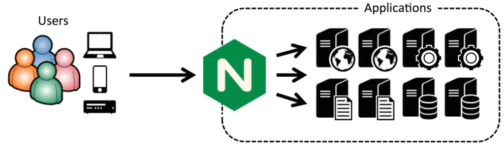

# DevOps Development Setup

- [Docker](#docker)
- [LXC](#lxc)


## Docker

Primero, actualice su lista existente de paquetes:

    sudo apt update -y

A continuación, instale algunos paquetes de requisitos previos que permitan aptusar paquetes a través de HTTPS:

    sudo apt install apt-transport-https ca-certificates curl software-properties-common -y

Luego agregue la clave GPG para el repositorio oficial de Docker a su sistema:

    curl -fsSL https://download.docker.com/linux/ubuntu/gpg | sudo gpg --dearmor -o /usr/share/keyrings/docker-archive-keyring.gpg

Agregue el repositorio Docker a las fuentes APT:

    echo "deb [arch=$(dpkg --print-architecture) signed-by=/usr/share/keyrings/docker-archive-keyring.gpg] https://download.docker.com/linux/ubuntu $(lsb_release -cs) stable" | sudo tee /etc/apt/sources.list.d/docker.list > /dev/null

Actualice su lista existente de paquetes nuevamente para que se reconozca la adición:

    sudo apt update

Asegúrese de que está a punto de instalar desde el repositorio de Docker en lugar del repositorio predeterminado de Ubuntu:

    apt-cache policy docker-ce

Verá un resultado como este, aunque el número de versión de Docker puede ser diferente:

`docker-ce:
Installed: (none)
Candidate: 5:20.10.14~3-0~ubuntu-jammy
Version table:
    5:20.10.14~3-0~ubuntu-jammy 500
        500 https://download.docker.com/linux/ubuntu jammy/stable amd64 Packages
    5:20.10.13~3-0~ubuntu-jammy 500
        500 https://download.docker.com/linux/ubuntu jammy/stable amd64 Packages`

Finalmente, instala Docker:

    sudo apt install docker-ce -y

Docker ahora debería estar instalado, el demonio iniciado y el proceso habilitado para iniciarse en el arranque. Comprueba que se está ejecutando:

    sudo systemctl status docker

De forma predeterminada, el comando docker solo puede ejecutarlo el usuario root o un usuario del grupo docker, que se crea automáticamente durante el proceso de instalación de Docker. Si intenta ejecutar el comando docker sin privilegios sudo o sin estar en el grupo docker, obtendrá un error. Para evitar escribir sudo cada vez que ejecuta comando, agregue su nombre de usuario al dockergrup:

    sudo usermod -aG docker ${USER}

Para aplicar la nueva pertenencia al grupo, cierre sesión en el servidor y vuelva a iniciarla, o escriba lo siguiente:

    su - ${USER}

Confirme que su usuario ahora está agregado al grupo docker escribiendo:

    groups

### Instalar Docker Compose

Primero, confirme la última versión disponible en su [página de github](https://github.com/docker/compose/releases). En el momento de escribir esto, la versión estable más actual es 2.12.2

Use el siguiente comando para descargar:

    mkdir -p ~/.docker/cli-plugins/
    curl -SL https://github.com/docker/compose/releases/download/v2.12.2/docker-compose-linux-x86_64 -o ~/.docker/cli-plugins/docker-compose

A continuación, establezca los permisos correctos para que docker compose sea ejecutable:

    chmod +x ~/.docker/cli-plugins/docker-compose

Para verificar que la instalación fue exitosa, puede ejecutar:

    docker compose version

Verá un resultado similar a este:

`Output
Docker Compose version v2.12.2`

## LXC

### Crear un linux containder con Ubuntu LTS

Para crear un LXC con Ubuntu LTS, ejecute lo siguiente en una shell de Proxmox.

    bash -c "$(wget -qLO - https://github.com/ctrbts/proxmox-scripts/raw/main/ct/ubuntu.sh)"

#### Creamos un nuevo usuario y lo agregamos al grupo sudo

    adduser NOMBRE_DE_USUARIO && usermod -aG sudo NOMBRE_DE_USUARIO

#### Preparamos Node para producción
Nodemon es una utilidad que monitoreará cualquier cambio en su codigo y reiniciará automáticamente su servidor.

    npm install -g nodemon

Pm2 nos sirve para levantar nuestra aplicación como un servicio demonio en nuestro servidor aparte nos ayuda a que este siempre arriba en caso de que se produzca un error, ejecutamos el siguiente comando como usuario root:

    npm install pm2 -g

Con los procesos en marcha, arrancados mediante PM2, ahora puedes generar de manera automatizada el correspondiente script, sin tener que preocuparte por la programación, ya que PM2 lo generará para ti. Para ello tenemos el comando siguiente:

    pm2 startup

Ese comando detectará la plataforma donde estás ejecutando, si es Linux, Mac, Windows y generará el script de arranque.

#### Instalamos Nginx

Es recomendable instalar un Reverse Proxy, lo haremos con Nginx para que básicamente haga lo siguiente:



Nos va a ayudar para que nuestra aplicación no sea accedida directamente desde el tráfico de internet, sino que pase por Nginx y este se encargue de poner en ruta la petición al puerto que se configure, de esta manera también optimizamos el uso de nuestro servidor.

    sudo apt-get install nginx

Para comprobar que se instaló de manera correcta y ver la versión:

    nginx -v

Abrimos el archivo de configuración de Nginx para editarlo:

    sudo nano /etc/nginx/nginx.conf

Agregamos la siguiente configuración:

```nginx
http {
    # OTRAS CONFIGURACIONES
    #...
    # CONFIGURAMOS NUESTRO PUERTO 443 PUERTO SEGURO
    server {
        listen       443 ssl http2 default_server;
        listen       [::]:443 ssl http2 default_server;
        server_name  _;
        root         /usr/share/nginx/html;

        #Ruta donde tenemos nuestro archivo .crt o .pem
        ssl_certificate "/home/ubuntu/apps/cert-quentify/certificate.crt";
        ssl_certificate_key "/home/ubuntu/apps/cert-quentify/key.key";
        ssl_session_cache shared:SSL:1m;
        ssl_session_timeout  10m;
        ssl_protocols TLSv1 TLSv1.1 TLSv1.2;
        ssl_ciphers HIGH:SEED:!aNULL:!eNULL:!EXPORT:!DES:!RC4:!MD5:!PSK:!RSAPSK:!aDH:!aECDH:!EDH-DSS-DES-CBC3-SHA:!KRB5-DES-CBC3-SHA:!SRP;
        ssl_prefer_server_ciphers on;

        # Load configuration files for the default server block.
        include /etc/nginx/default.d/*.conf;

        # CONFIGURAMOS LOCALHOST PUERTO 5002
        # DONDE NUESTRA APLICACION ESTA ESCUCHANDO
        location / {
            proxy_pass http://127.0.0.1:5002;
        }

        # CONFIGURACION DE PAGINAS DE ERRORES
        error_page 404 /404.html;
            location = /40x.html {
        }

        error_page 500 502 503 504 /50x.html;
            location = /50x.html {
        }
    }

    # CONFIGURAMOS PARA QUE TODOS LAS PETICIONES QUE LLEGAN
    # AL PUERTO 80 SE REDIRIJAN AL PROTOCOLO HTTPS
    # CONFIGURAMOS DOMINIO
    server {
        listen 80 default_server;
        listen [::]:80 default_server;
        server_name _;
        return 301 https://www.quentify.com;
    }

}
```

Con esta configuración seteamos el puerto 443 para https y 80 para http, en las líneas 9 y 10 hacemos referencia a nuestros archivos de nuestro certificado SSL.

Con el comando nano entramos en una especie de editor, agregamos la configuración, presionamos ctrl+x luego Y y enter.

Verificamos que el archivo nginx.conf este correcto con:

sudo nginx -t
Para actualizar la nueva configuración reiniciamos el servicio de Nginx con:

sudo service nginx reload
Ya podemos acceder a nuestro sitio mediante nuestra URL.


### Crear un linux containder con Debian 11 (Bullseye) + MariaDB 10.11

Para crear un LXC con Mariadb, ejecute lo siguiente en una shell de Proxmox.

    bash -c "$(wget -qLO - https://github.com/ctrbts/proxmox-scripts/raw/main/ct/mariadb.sh)"

Configuración predeterminada: 1GB de RAM - 4GB Almacenamiento - 1vCPU

Para permitir a MariaDB escuchar conexiones remotas, necesita editar el archivo predeterminado. Para ello, abra la consola en su MariaDB lxc:

    nano /etc/mysql/my.cnf

Descomenta `port = 3306`, guardar y salir del editor con "Ctrl-O", "Enter" y "Ctrl X". Luego:

    nano /etc/mysql/mariadb.conf.d/50-server.cnf

Comente `bind-address = 127.0.0.1`, guardar y salir del editor con "Ctrl-O", "Enter" y "Ctrl X".

Para las nuevas instalaciones de MariaDB, el siguiente paso es ejecutar el script de seguridad incluido. Este script cambia algunas de las opciones predeterminadas menos seguras. Lo usaremos para bloquear los logins remotos y para eliminar usuarios de bases de datos no utilizados.

Ejecute lo siguiente:

    sudo mysql_secure_installation

Y en el script interactivo debería contestar lo siguiente:

    Enter current password for root (enter for none): enter
    Switch to unix_socket authentication [Y/n] y
    Change the root password? [Y/n] n
    Remove anonymous users? [Y/n] y
    Disallow root login remotely? [Y/n] y
    Remove test database and access to it? [Y/n] y
    Reload privilege tables now? [Y/n] y

Crearemos una nueva cuenta llamada admin con las mismas capacidades que la cuenta raíz, pero configurada para la autenticación de contraseñas.

    sudo mariadb

Creamos un nuevo administrador (cambie el nombre de usuario y la contraseña para que coincidan con sus preferencias)

En contenedores administrados por Proxmox no tiene sentido el acceso externo. Una cuenta local es sufciente y garantiza la seguridad del contenedor

    CREATE USER 'admin'@'localhost' IDENTIFIED BY 'password';

Le damos privilegios de root (cambie el nombre de usuario y la contraseña para que coincidan con sus preferencias)

    GRANT ALL ON *.* TO 'admin'@'localhost' IDENTIFIED BY 'password' WITH GRANT OPTION;

Puede permitir el acceso root desde cualquier lugar de su red de área local (LAN), con direcciones en la subred 192.168.100.0/24. Cambie el nombre de usuario, la contraseña y la subred para que coincida con tus preferencias:

    GRANT ALL ON *.* TO 'admin'@'192.168.100.%' IDENTIFIED BY 'password' WITH GRANT OPTION;

Refrescar los privilegios para asegurar que se guarden y estén disponibles en la sesión actual:

    FLUSH PRIVILEGES;

Después de esto, salga de la consola de MariaDB:

    exit

Ya puede iniciar sesión como el nuevo usuario que acaba de crear:

    mysql -u admin -p

Reiniciar el lxc

Puede comprobar el estado del servicio con:

    sudo systemctl status mariadb

Para actualizar Mariadb, dentro de la consola ejecute:

    apt update && apt upgrade -y
